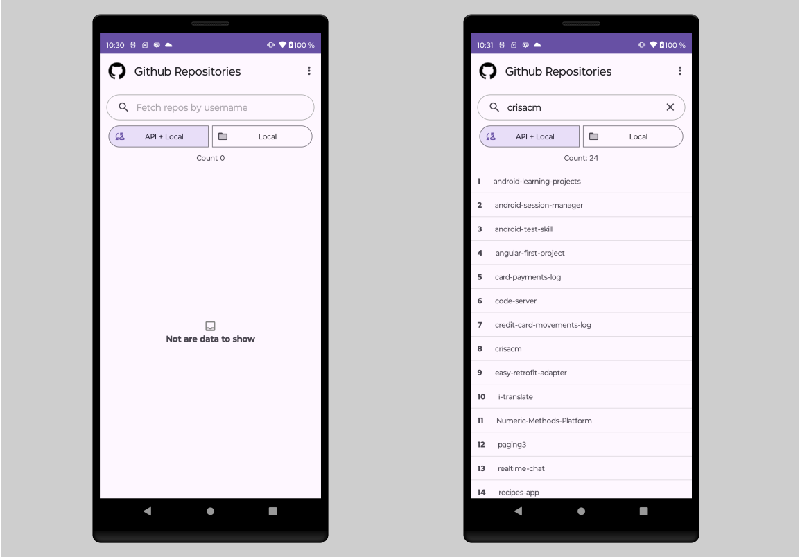

# paging3

## 💡 About

Implementing Paging3 with Flow, Retrofit and Room database

## 🎛️ Behavior

- [X] Get repositories by user from GitHub service.
- [X] Store the information obtained locally.

## 🚀 Technologies

- Hilt
- Flow, ViewModel
- Retrofit
- Room
- Detekt
- Ktlint
